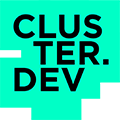

# Selamat Datang

[Terraform](https://www.terraform.io) merupakan sebuah proyek (sebagaimana banyaknya alat-alat DevOps lainnya) yang relatif baru yang dimulai pada tahun 2014.

Terraform adalah alat yang ampuh (mungkin alat yang paling ampuh di luar sana saat ini) dan merupakan alat yang paling banyak digunakan untuk mengelola infrastruktur sebagai kode (Infrastructure as Code/IaC). Terraform memungkin pengembang untuk melakukan banyak hal dan tidak membatasi mereka melakukannya dengan cara yang akan sulit untuk didukung atau diintegrasi dengan sistem lain.

Beberapa informasi yang dijabarkan pada buku ini mungkin tampak tidak seperti praktik terbaik. Ini merupakan hal yang lumrah. Untuk membantu pembaca memisahkan antara praktik terbaik yang telah teruji atau cara dogmatis lainnya untuk melakukan hal yang sama, penulis sesekali menggunakan petunjuk untuk menyediakan konteks dan ikon-ikon untuk menentukan level kematangan dari setiap subbagian yang terkait dengan praktik terbaik.

Buku ini mulai ditulis di Madrid yang cerah pada tahun 2018. Buku ini tersedia secara gratis di [https://www.terraform-best-practices.com/](https://www.terraform-best-practices.com)

Beberapa tahun kemudian buku ini telah diperbarui dengan konten praktik terbaik dari Terraform versi 1.0. Pada akhirnya, buku ini akan berisi sebagian besar dari praktik terbaik dan rekomendasi yang tidak terbantahkan bagi para pengguna Terraform.

## Alih bahasa


[English](https://app.gitbook.com/o/-LMqIrDlzEiI-N4uHrWg/s/e1Mp2scOX6OnQbifCen3/)



[Español (Spanish)](https://app.gitbook.com/o/-LMqIrDlzEiI-N4uHrWg/s/fTxekzr50pIuGmrPkXUD/)



[Français (French)](https://app.gitbook.com/o/-LMqIrDlzEiI-N4uHrWg/s/6shyPtr2KrqW4ANbFXYg/)



[Deutsch (German)](https://app.gitbook.com/o/-LMqIrDlzEiI-N4uHrWg/s/PKopCWJZbhpQ9FT0W8tL/)



[עברית (Hebrew)](https://app.gitbook.com/o/-LMqIrDlzEiI-N4uHrWg/s/4bq6CyY8vYiEHkjN63rT/)



[Italiano (Italian)](https://app.gitbook.com/o/-LMqIrDlzEiI-N4uHrWg/s/8VlMHbHDbW6qRWdgN5oU/)



[Português (Brazilian Portuguese)](https://app.gitbook.com/o/-LMqIrDlzEiI-N4uHrWg/s/B48qUSNPO2XmkIySLzfr/)



[Polski (Polish)](https://app.gitbook.com/o/-LMqIrDlzEiI-N4uHrWg/s/9yChMGbFo2G47Wiow1yY/)



[Română (Romanian)](https://app.gitbook.com/o/-LMqIrDlzEiI-N4uHrWg/s/sFM1GW5TPCGsskQ03mTm/)



[Українська (Ukrainian)](https://app.gitbook.com/o/-LMqIrDlzEiI-N4uHrWg/s/tXRvMPILxeJaJTM2CsSq/)


Hubungi penulis jika Anda ingin membantu menerjemahkan buku ini ke dalam bahasa lainnya.

## Kontribusi

Penulis ingin selalu mendapat umpan balik dan masukan terhadap buku ini sebagai komunitas yang matang dan ide-ide baru diimplementasikan dan diverifikasi dari waktu ke waktu.

Jika Anda tertarik pada topik tertentu, silakan [buat isu baru](https://github.com/antonbabenko/terraform-best-practices/issues) atau acungkan jempol Anda pada isu yang paling ingin masuk cakupan. Jika Anda mempunyai konten dan Anda ingin berkontribusi, tulis draf dan kirimkan permintaan penarikan/_pull request_ (Tidak perlu khawatir soal penulisan naskah yang baik pada titik ini)

## Penulis

Buku ini dikelola oleh [Anton Babenko](https://github.com/antonbabenko) dengan bantuan dari berbagai kontributor dan pengalih bahasa.

## Sponsor

|  | [Cluster.dev](http://cluster.dev) — the only manager for cloud-native infrastructures.                   |
| --------------------------------------------------------------------- | -------------------------------------------------------------------------------------------------------- |
|   | [Coder.com](http://coder.com/) — create remote development machines for your team, powered by Terraform. |

## Lisensi

Tulisan ini menggunakan lisensi Apache 2. Lihat berkas LICENSE untuk detail penuh.

Penulis dan kontributor konten ini tidak memberikan garansi akan validitas informasi yang ada di dalam tulisan ini. Pastikan Anda mengerti bahwa informasi yang disediakan pada tulisan ini bersifat gratis, dan tidak ada perjanjian atau kontrak yang dibuat antara Anda dan orang-orang yang terkait dengan konten atau proyek ini. Penulis dan kontributor tidak bertanggung jawab terhadap pihak manapun atas kerugian, kerusakan, dan gangguan yang ditimbulkan akibat kesalahan atau kelalaian informasi yang terkandung, terkait, ataupun dihubungan pada konten ini. Baik itu kesalahan atau kelalaian yang bersumber pada kelalaian, kecelakaan, atau penyebab-penyebab lainnya.

Hak cipta © 2018-2022 Anton Babenko.
