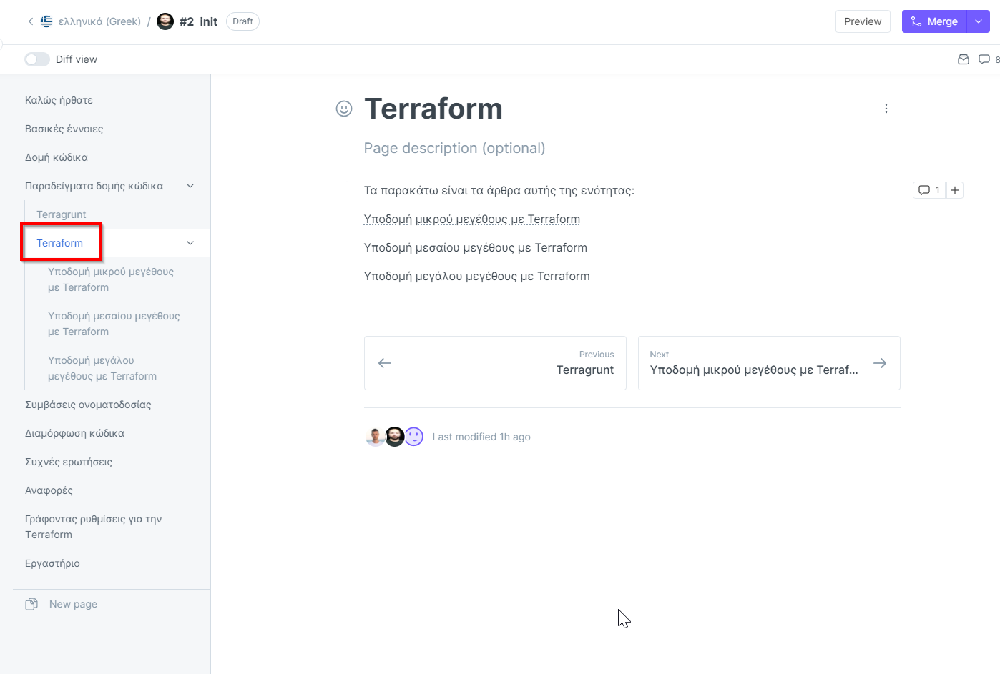

# 欢迎阅读

[Terraform](https://www.terraform.io/) 是一款非常强大（如果不是现在最强大的）的工具，也是最常用的基础设施即代码管理工具之一。它使开发人员可以做很多事情，并且帮助开发人员轻松应对各种复杂实现或集成。

本书中描述的一些信息可能并不像是最佳实践。为了帮助读者区分哪些是已经确立的最佳实践，哪些是个人偏好的最佳实践，我有时使用提示来提供一些上下文，并使用图标来指定与最佳实践相关的各个小节的成熟度水平。

本书于2018年在阳光明媚的马德里开始编写，可在此处免费获取 - [https://www.terraform-best-practices.com/](https://www.terraform-best-practices.com/) 。\
\
经过若干年不断迭代更新，它包含了更多与Terraform 1.0相关的实际最佳实践。最终，本书应该包含大多数无可争议的最佳实践和对 Terraform 用户的建议。

## 其他语言版本


[English](http://localhost:5000/o/-LMqIrDlzEiI-N4uHrWg/s/e1Mp2scOX6OnQbifCen3/)



[Español (Spanish)](http://localhost:5000/o/-LMqIrDlzEiI-N4uHrWg/s/fTxekzr50pIuGmrPkXUD/)



[Bahasa Indonesia (Indonesian)](http://localhost:5000/o/-LMqIrDlzEiI-N4uHrWg/s/ZLCz7lNWbSJxDGuNOI44/)



[Bosanski (Bosnian)](http://localhost:5000/o/-LMqIrDlzEiI-N4uHrWg/s/PJbgKPAX0ohEMLpETpg7/)



[Français (French)](http://localhost:5000/o/-LMqIrDlzEiI-N4uHrWg/s/6shyPtr2KrqW4ANbFXYg/)



[Deutsch (German)](http://localhost:5000/o/-LMqIrDlzEiI-N4uHrWg/s/PKopCWJZbhpQ9FT0W8tL/)



[עברית (Hebrew)](http://localhost:5000/o/-LMqIrDlzEiI-N4uHrWg/s/4bq6CyY8vYiEHkjN63rT/)



[Italiano (Italian)](http://localhost:5000/o/-LMqIrDlzEiI-N4uHrWg/s/8VlMHbHDbW6qRWdgN5oU/)



[ಕನ್ನಡ (Kannada)](http://localhost:5000/o/-LMqIrDlzEiI-N4uHrWg/s/BoZVs6O2OJFQLNV1utmm/)



[हिंदी (Hindi)](http://localhost:5000/o/-LMqIrDlzEiI-N4uHrWg/s/Mgong4S6IjtibE055zUM/)



[Português (Brazilian Portuguese)](http://localhost:5000/o/-LMqIrDlzEiI-N4uHrWg/s/B48qUSNPO2XmkIySLzfr/)



[Polski (Polish)](http://localhost:5000/o/-LMqIrDlzEiI-N4uHrWg/s/9yChMGbFo2G47Wiow1yY/)



[Română (Romanian)](http://localhost:5000/o/-LMqIrDlzEiI-N4uHrWg/s/sFM1GW5TPCGsskQ03mTm/)



[Türkçe (Turkish)](http://localhost:5000/o/-LMqIrDlzEiI-N4uHrWg/s/Fedpbc5NbKjynXI8xTeF/)



[Українська (Ukrainian)](http://localhost:5000/o/-LMqIrDlzEiI-N4uHrWg/s/tXRvMPILxeJaJTM2CsSq/)


若您有意参与本书翻译，请与我联系。

## 贡献

随着社区的日益成熟和新思路的不断实践和验证，我一直希望得到反馈并更新本书。\
\
如果你对某些话题感兴趣，请[开启新问题](https://github.com/antonbabenko/terraform-best-practices/issues)，或者点赞您感兴趣的问题。如果您有**补充内容**并且想要贡献，请提交pull request（不必担心文字是否华丽）。

## 作者

本书在不同贡献者和翻译人员的协助下由 [Anton Babenko](https://github.com/antonbabenko) 维护。

## 赞助商

|  | [Cluster.dev](http://cluster.dev/) — 云原生架构唯一管理工具。                |
| --------------------------------------------------------------------------------------------------------- | ---------------------------------------------------------------- |
|                                                                             | [Coder.com](http://coder.com/) — 为您的团队创建由 Terraform 提供支持的远程开发机器。 |

## 版权

本书使用Apache 2 License许可协议，具体请查看协议本身。

本书作者和贡献者无法保证本书内容的有效性。 请确保您了解本书提供的信息是免费提供的，并且您与此内容或项目相关的任何人之间没有任何协议或合同。 作者和贡献者不承担任何一方因本内容中包含的、关联的或链接的信息的错误或遗漏而造成的任何损失、损害或中断的任何责任，无论此类错误或遗漏是由于疏忽、事故或任何其他原因造成的。

版权所有 © 2018-2022 Anton Babenko。
