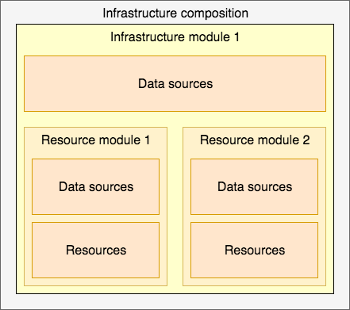

# Key concepts

The official Terraform documentation describes [all aspects of configuration in details](https://www.terraform.io/docs/configuration/index.html). Read it carefully to understand the rest of this section.

This section describes key concepts which are used inside the book.

## Resource

Resource is `aws_vpc`, `aws_db_instance`, etc. Resource belongs to provider, accepts arguments, outputs attributes, has lifecycles. Resource can be created, retrieved, updated, and deleted.

## Resource module

Resource module is a collection of connected resources which together perform the common action \(for eg, [AWS VPC Terraform module](https://github.com/terraform-aws-modules/terraform-aws-vpc/) creates VPC, subnets, NAT gateway, etc\). It depends on provider configuration, which can be defined in it, or in higher level structures \(eg, in infrastructure module\).

## Infrastructure module

Infrastructure module is a collection of resource modules, which can be logically not connected, but in the current situation/project/setup are serving the same purpose. It defines configuration for providers, which is passed to the downstream resource modules and to resources. It is normally limited to work in one entity per logical separator \(eg, AWS Region, Google Project\). An example is [terraform-aws-atlantis](https://github.com/terraform-aws-modules/terraform-aws-atlantis/) which uses resource modules like [terraform-aws-vpc](https://github.com/terraform-aws-modules/terraform-aws-vpc/) and [terraform-aws-security-group](https://github.com/terraform-aws-modules/terraform-aws-security-group/) to create infrastructure required for running [Atlantis](https://www.runatlantis.io) on [AWS Fargate](https://aws.amazon.com/fargate/).

## Composition

Composition is a collection of infrastructure modules, which can span across several logically separated areas \(eg., AWS Regions, several AWS accounts\). Composition is used to describe the complete infrastructure required for the whole organization or project.

Composition consists of infrastructure modules, which consist of resources modules, which implement individual resources.



## Data source

Data source performs read-only operation and is dependant on provider configuration, it is used in a resource module and an infrastructure module.

Data source `terraform_remote_state` acts as a glue for higher level modules and compositions.

The [external](https://www.terraform.io/docs/providers/external/data_source.html) data source allows an external program to act as a data source, exposing arbitrary data for use elsewhere in the Terraform configuration.

The [http](https://www.terraform.io/docs/providers/http/data_source.html) data source makes an HTTP GET request to the given URL and exports information about the response which is often useful to get information from endpoints where native Terraform provider does not exist.

## Remote state

Infrastructure modules and compositions should persist their state in a remote location which can be reached by others in a controllable way \(ACL, versioning, logging\).

## Provider, provisioner, etc

Providers, provisioners and few other terms are described very well on the official documentation and there is no point to repeat it here. To my opinion they have little to do with writing good Terraform modules. More details will be provided later.

## Why so _difficult_?

While individual resources are like atoms in the infrastructure, resource modules are molecules. Module is a smallest versioned and shareable unit. It has exact list of arguments, implement basic logic for such unit to do required function. Eg. [terraform-aws-security-group](https://github.com/terraform-aws-modules/terraform-aws-security-group) creates `aws_security_group` and `aws_security_group_list` resources based on input. This resource module by itself can be used together with other modules to create infrastructure module.

Access to data across molecules \(resource modules and infrastructure modules\) is performed using (module) outputs and data sources.

Access between compositions is performed using remote state data sources.

When putting concepts described above in pseudo-relations it may look like this:

```text
composition-1 {
  infrastructure-module-1 {
    data-source-1 => d1

    resource-module-1 {
      data-source-2 => d2
      resource-1 (d1, d2)
      resource-2 (d2)
    }

    resource-module-2 {
      data-source-3 => d3
      resource-3 (d1, d3)
      resource-4 (d3)
    }
  }

}
```

