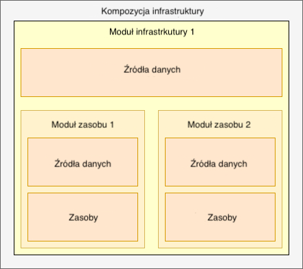

# Kluczowe koncepty

Oficjalna dokumentacja Terraforma szczegółowo [opisuje wszystkie aspekty konfiguracji](https://www.terraform.io/language). Przeczytaj ją uważnie, aby zrozumieć resztę tej sekcji.

Ta sekcja opisuje kluczowe pojęcia, które są używane w książce.

## Zasób (resource)

Przykładowe zasoby to `aws_vpc`, `aws_db_instance`, itd. Zasób należy do dostawcy (provider), może przyjmować argumenty (parameters) oraz zwracać różne atrybuty (outputs) i ma swój cykl życia (lifecycle). Może on być tworzony, pobierany, aktualizowany i usuwany.

## Moduł zasobu (resource module)

Moduł zasobu to zbiór połączonych zasobów, które razem wykonują wspólną akcję (np. moduł [AWS VPC Terraform](https://github.com/terraform-aws-modules/terraform-aws-vpc/) tworzy VPC, podsieci, bramę NAT itp.). Jest on zależny od konfiguracji dostawcy, którą można zdefiniować w nim lub w strukturach na wyższym poziomie (np. w module infrastruktury).

## Moduł infrastruktury (infrastructure module)

Moduł infrastruktury to zbiór modułów zasobów, które nie muszą być ze sobą logicznie połączone, ale mogą, współpracując ze sobą służyć temu samemu celowi. Definiuje konfigurację dla dostawców, która jest następnie przekazywana do modułów zasobów podrzędnych i do samodzielnych zasobów. Zwykle ogranicza się on do pracy w pojedynczej encji na każdy logiczny separator (np. region AWS, projekt Google).

Na przykład moduł [terraform-aws-atlantis](https://github.com/terraform-aws-modules/terraform-aws-atlantis/) wykorzystuje moduły zasobów, takie jak [terraform-aws-vpc](https://github.com/terraform-aws-modules/terraform-aws-vpc/) i [terraform-aws-security-group](https://github.com/terraform-aws-modules/terraform-aws-security-group/), do zarządzania infrastrukturą wymaganą do uruchomienia [Atlantis](https://www.runatlantis.io) na [AWS Fargate](https://aws.amazon.com/fargate/).

Innym przykładem jest moduł [terraform-aws-cloudquery](https://github.com/cloudquery/terraform-aws-cloudquery), w którym wiele modułów [terraform-aws-modules](https://github.com/terraform-aws-modules/) jest używanych razem do zarządzania infrastrukturą, a także do tworzenia, wypychania i wdrażania obrazów platformy Docker. Wszystko w jednym miejscu.

## Kompozycja (composition)

Kompozycja to zbiór modułów infrastruktury, które mogą obejmować kilka logicznie oddzielonych obszarów (np. regiony AWS, kilka kont AWS). Kompozycja służy do opisania kompletnej infrastruktury wymaganej dla całej organizacji lub projektu.

Kompozycja składa się z modułów infrastruktury, na które składają się moduły zasobów, które realizują poszczególne zasoby



## Źródło danych (data source)

Źródło danych wykonuje operacje tylko do odczytu (read-only) i jest zależne od konfiguracji dostawcy. Jest ono używane w module zasobów i module infrastruktury.

Źródło danych `terraform_remote_state` działa jako spoiwo dla modułów i kompozycji wyższego poziomu.

[Zewnętrzne](https://registry.terraform.io/providers/hashicorp/external/latest/docs/data-sources/data\_source) źródło danych umożliwia, aby zewnętrzny program działał jako źródło danych, udostępniając dowolne dane do użycia w innym miejscu w konfiguracji Terraform. Oto przykład z modułu [terraform-aws-lambda](https://github.com/terraform-aws-modules/terraform-aws-lambda/blob/258e82b50adc451f51544a2b57fd1f6f8f4a61e4/package.tf#L5-L7), w którym nazwa pliku jest uzyskiwana poprzez wywołanie zewnętrznego skryptu Python.

Źródło danych [http](https://registry.terraform.io/providers/hashicorp/http/latest/docs/data-sources/http) wysyła żądanie HTTP GET do podanego adresu URL i zwraca informacje o odpowiedzi. Jest to często przydatne w uzyskiwaniu informacji z punktów końcowych (endpoints), dla których nie istnieje natywny dostawca Terraform.

## Zdalny zapis stanu infrastruktury (remote state)

Moduły infrastruktury i kompozycje powinny zachowywać swój [stan Terraform](https://www.terraform.io/docs/language/state/index.html) w zdalnej lokalizacji, gdzie mogą być pobierane przez inne osoby w kontrolowany sposób (np. z ACL, wersjonowaniem, rejestrowaniem).

## Dostawca (provider, provisioner)

Dostawca jest bardzo dobrze [opisany w oficjalnej dokumentacji](https://www.terraform.io/language/providers). Nie ma więc sensu tego tutaj powtarzać. Moim zdaniem ma on niewiele wspólnego z pisaniem dobrych modułów w Terraform.

## Skąd te _trudności_?

Podczas gdy poszczególne zasoby są jak atomy w infrastrukturze, moduły zasobów są molekułami. Moduł jest najmniejszą jednostką, którą wersjonujemy i możemy udostępniać innym. Ma dokładną listę argumentów i implementuje podstawową logikę. Na przykład moduł [terraform-aws-security-group](https://github.com/terraform-aws-modules/terraform-aws-security-group) tworzy zasoby `aws_security_group` oraz `aws_security_group_rule` na podstawie danych wejściowych. Może on być użyty razem z innymi modułami do stworzenia modułu infrastruktury.

Dostęp do danych oraz wymiana między nimi (moduły zasobów i moduły infrastruktury) jest realizowany z wykorzystaniem wyjść modułów (module output) i źródeł danych.

Dostęp między kompozycjami jest często realizowany przy użyciu zdalnych źródeł danych stanu. Istnieje wiele sposobów na [udostępnianie danych między konfiguracjami](https://www.terraform.io/language/providers).

Starając się przedstawić opisane powyżej pojęcia przy pomocy pseudorelacji uzyskamy następującą strukturę:

```
composition-1 {
  infrastructure-module-1 {
    data-source-1 => d1

    resource-module-1 {
      data-source-2 => d2
      resource-1 (d1, d2)
      resource-2 (d2)
    }

    resource-module-2 {
      data-source-3 => d3
      resource-3 (d1, d3)
      resource-4 (d3)
    }
  }

}
```
