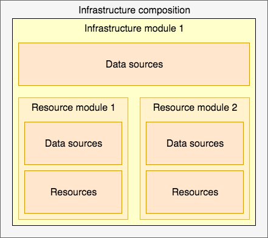

---
metaLinks:
  alternates:
    - https://app.gitbook.com/s/e1Mp2scOX6OnQbifCen3/key-concepts
---

# Негізгі тұжырымдамалар

Ресми Terraform құжаттамасы [конфигурацияның барлық аспектілерін егжей-тегжейлі](https://www.terraform.io/docs/configuration/index.html) сипаттайды. Осы бөлімнің қалған бөлігін түсіну үшін оны мұқият оқып шығыңыз.Бұл бөлім кітап ішінде қолданылатын негізгі ұғымдарды сипаттайды.

### Ресурс

Ресурс - бұл `aws_vpc`, `aws_db_instance`,және т.б. Ресурс провайдерге тиесілі, аргументтерді қабылдайды, атрибуттарды шығарады және өмірлік циклге ие.
&#x20;Ресурсты жасауға, алуға, жаңартуға және жоюға болады.

### Ресурс модулі

Ресурс модулі — бұл бірге жалпы әрекетті орындайтын байланысқан ресурстар жиынтығы (мысалы, [_AWS VPC Terraform модулі_](https://github.com/terraform-aws-modules/terraform-aws-vpc/) VPC, ішкі желілер, NAT шлюзі және т.б., жасайды).\
&#x20;Ол провайдер конфигурациясына тәуелді, бұл конфигурация оның ішінде немесе жоғары деңгейлі құрылымдарда (мысалы, инфрақұрылым модулінде) анықталуы мүмкін.

### Инфрақұрылым модулі

Инфрақұрылым модулі - бұл логикалық тұрғыдан байланыспаған болуы мүмкін, бірақ ағымдағы жағдайда/жобада/орнатуда бір мақсатқа қызмет ететін ресурс модульдерінің жиынтығы. Ол төменгі деңгейдегі ресурс модульдеріне және ресурстарға берілетін провайдерлерге арналған конфигурацияны анықтайды. Ол әдетте бір логикалық бөлгішке (мысалы, AWS аймағы, Google жобасы) бір нысанмен жұмыс істеуге шектеледі.

Мысалы, [\`terraform-aws-atlantis\`](https://github.com/terraform-aws-modules/terraform-aws-atlantis/) модулі [AWS Fargate](https://aws.amazon.com/fargate/) қызметінде [Atlantis](https://www.runatlantis.io)-ті іске қосу үшін қажетті инфрақұрылымды басқару үшін [\`terraform-aws-vpc\`](https://github.com/terraform-aws-modules/terraform-aws-vpc/) және [\`terraform-aws-security-group\`](https://github.com/terraform-aws-modules/terraform-aws-security-group/) сияқты ресурс модульдерін пайдаланады.

Тағы бір мысал - [\`terraform-aws-cloudquery\`](https://github.com/cloudquery/terraform-aws-cloudquery) модулі, мұнда [\`terraform-aws-modules\`](https://github.com/terraform-aws-modules/) ұсынған бірнеше модульдер инфрақұрылымды басқару үшін бірге пайдаланылады, сонымен қатар Docker кескіндерін құру (build), итеру (push) және орналастыру (deploy) үшін Docker ресурстары қолданылады. Барлығы бір жиынтықта.

### Композиция

Композиция - бұл бірнеше логикалық бөлінген аймақтарды (мысалы, AWS аймақтары, бірнеше AWS тіркелгілері) қамти алатын инфрақұрылым модульдерінің жиынтығы. Композиция бүкіл ұйым немесе жоба үшін қажетті толық инфрақұрылымды сипаттау үшін қолданылады.

Композиция инфрақұрылым модульдерінен тұрады, ал олар жеке ресурстарды жүзеге асыратын ресурс модульдерінен тұрады.



### Дереккөз

Дереккөз тек оқуға арналған операцияны орындайды және провайдер конфигурациясына тәуелді, ол ресурс модулінде және инфрақұрылым модулінде қолданылады.

&#x20;`terraform_remote_state` дереккөзі жоғары деңгейлі модульдер мен композициялар үшін «желім» қызметін атқарады.

[Сыртқы](https://registry.terraform.io/providers/hashicorp/external/latest/docs/data-sources/external) дереккөз сыртқы бағдарламаға дереккөз ретінде әрекет етуге мүмкіндік береді, бұл Terraform конфигурациясының басқа жерінде пайдалану үшін еркін деректерді шығарады. Мұнда файл атауы сыртқы Python скриптін шақыру арқылы есептелетін [terraform-aws-lambda module](https://github.com/terraform-aws-modules/terraform-aws-lambda/blob/258e82b50adc451f51544a2b57fd1f6f8f4a61e4/package.tf#L5-L7) модулінен мысал келтірілген.

&#x20;[http](https://registry.terraform.io/providers/hashicorp/http/latest/docs/data-sources/http) дереккөзі берілген URL мекенжайына HTTP GET сұрауын жасайды және жауап туралы ақпаратты экспорттайды, бұл көбінесе тума (native) Terraform провайдері жоқ соңғы нүктелерден ақпарат алу үшін пайдалы

### Қашықтағы күй

Әрбір инфрақұрылым модулі мен композиция үшін [Terraform күйін](https://www.terraform.io/docs/language/state/index.html) ACL (қол жеткізуді басқару тізімдері), нұсқалау және логтаумен конфигурацияланған қашықтағы бэкендте сақтаңыз. Бұл жалғыз, беделді ақиқат көзі орталарды бірізді ұстайды және әдетте автоматтандырылған резервтік көшірмелер сияқты апаттан кейін қалпына келтіру мүмкіндіктерін қамтиды. Күйді жергілікті басқару бірнеше әзірлеуші Terraform-ды бір уақытта қосқанда бірлескен жұмыс мәселелеріне және жарыс жағдайларына әкеліп соғуы мүмкін, нәтижесінде күтпеген жағдайлар орын алады.

### Провайдер, провизионер және т.б.

Провайдерлер, провизионерлер және басқа да бірнеше терминдер ресми құжаттамада өте жақсы сипатталған және оларды бұл жерде қайталаудың қажеті жоқ. Менің ойымша, олардың жақсы Terraform модульдерін жазуға қатысы шамалы.

### Неге сонша қиын?

Жеке ресурстар инфрақұрылымдағы атомдар сияқты болса, ресурс модульдері — молекулалар (атомдардан тұратын). Модуль — ең кіші нұсқаланған және бөлісуге болатын бірлік. Оның нақты аргументтер тізімі бар, қажетті функцияны орындау үшін осындай бірліктің негізгі логикасын жүзеге асырады. Мысалы, [\`terraform-aws-security-group\`](https://github.com/terraform-aws-modules/terraform-aws-security-group) модулі кіріс деректер негізінде  `aws_security_group` және `aws_security_group_rule` ресурстарын жасайды. Бұл ресурс модулінің өзін инфрақұрылым модулін құру үшін басқа модульдермен бірге пайдалануға болады.

Молекулалар (ресурс модульдері және инфрақұрылым модульдері) арасында деректерге қол жеткізу модульдердің шығыстары және дереккөздері арқылы жүзеге асырылады.

Композициялар арасындағы қолжетімділік көбінесе қашықтағы күй дереккөздері арқылы жүзеге асырылады. Конфигурациялар [арасында деректерді бөлісудің бірнеше жолы бар](https://www.terraform.io/docs/language/state/remote-state-data.html#alternative-ways-to-share-data-between-configurations).

Жоғарыда сипатталған ұғымдарды псевдо-қатынастарға салғанда, ол келесідей көрінуі мүмкін:

```
composition-1 {
  infrastructure-module-1 {
    data-source-1 => d1

    resource-module-1 {
      data-source-2 => d2
      resource-1 (d1, d2)
      resource-2 (d2)
    }

    resource-module-2 {
      data-source-3 => d3
      resource-3 (d1, d3)
      resource-4 (d3)
    }
  }
}
```
